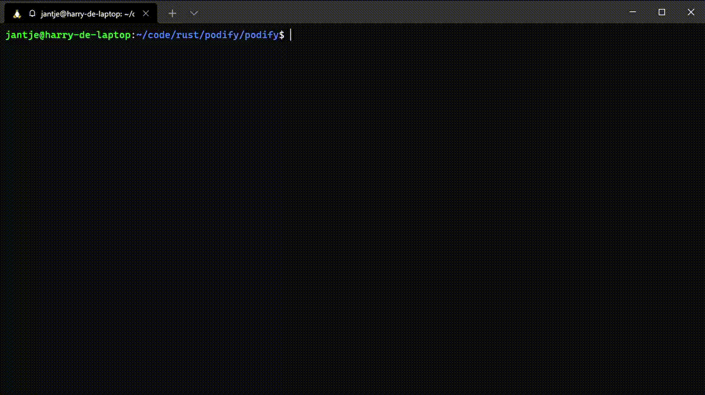

# Podify
Podify is a simple Docker clone written in Rust. It is part of a school assignment for which I needed to understand the inner-workings of Docker.

## Example

## Running
Simply run `setup.sh`. After which you can run the following commands:
- Run `sudo ./target/debug/podify sh` to start a shell in the pod
- Run `sudo ./target/debug/podify /test` to run the test program
